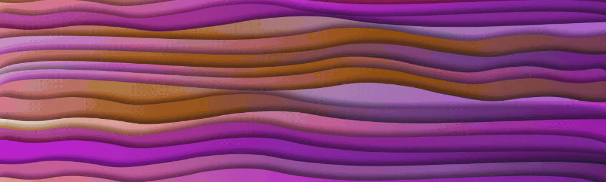
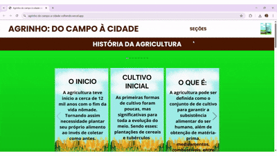
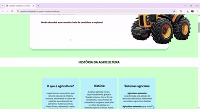
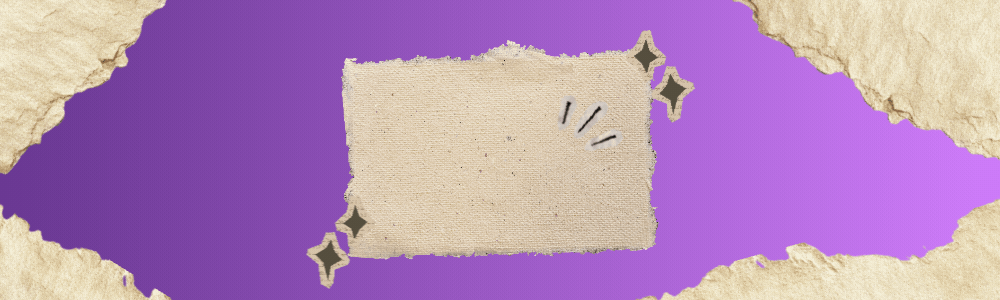

  

Hello, I'm <b>Emily Caputi</b>, a Computer Science student at UniFil, and I love discovering new things about programming.

  

<h2 align="center">✨About Me!</h2>

I'm continually learning and researching to improve my development skills.

 
- 📍 **Location**: Brazil.
- 🎓 **Education:** Computer Science student at **UniFil**.
- 🤖 **Learning Now:** Artificial Intelligence Specialist at **Alura**.
- 📖 **Previous Courses:** Web Development (HTML/CSS) and Logic at **Alura**.
- 📚 **Interests:** Logic programming, reading, English and music. 
- 🌌 **Curiosity:** I love reading about everything.
- 🏆 **Achievement:** State finalist in the **Agrinho Contest** (High School).

  

<h2 align="center">🛠Languages!</h2>
 
- ☕ **Java**
- 🌐 **HTML/CSS**
- 📜 **JavaScript**
- 🐍 **Python**
  

<h2 align="center">📂Best Projects!</h2>
 
<table align="center">
  <tr>
    <td align="center" width="50%">
      
       
      <b>"Agrinho: do campo a cidade colhendo oportunidades"</b>
      
🥇State finalist project, all encoded and drawn by me.

    </td>
    <td align="center" width="50%">
      
         
        <b>🌟"Agrinho: festejando a conexão campo e cidade"</b>
      
My favorite project, designed and programmed by me.

    </td>
  </tr>
</table>
  

<h2 align="center">🌌My portfolio!</h2>
 
<table align="center">
  <tr>
    <td align="center" width="90%">
      
       
      <b>Click to see more of my projects 🖱️</b>
    </td>
  </tr>
</table>
  

<h2 align="center">💻 Most used programming languages!</h2>

 

<table align="center">
  <tr>
    <td>
      
    </td>
    <td>
      
    </td>
  </tr>
</table>

 
 

<h2 align="center">📫 Contact me!</h2>

 

  
  
    

 
 

  

